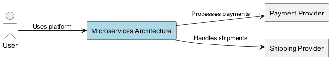
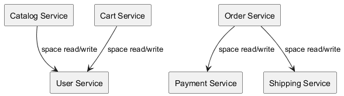
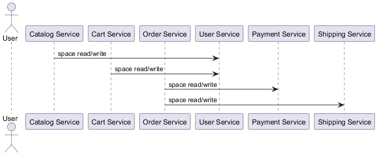
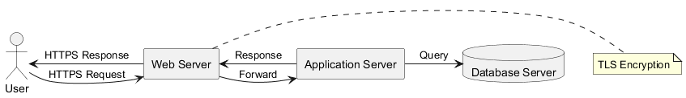

# Architectural Documentation

---

## 1. Introduction

This document presents the architectural description of **Microservices Architecture**. The objective of this documentation is to provide a structured and comprehensive overview of the system’s architectural drivers, quality requirements, constraints, design trade-offs, and structural views.

The documentation follows common architectural documentation practices (inspired by IEEE 1016), aiming to support both technical understanding and design evaluation.

The following sections describe the key architectural drivers, quality attribute scenarios, constraints, stakeholder concerns, and the evaluation of the selected architecture. Finally, UML views are presented to visually represent the system.

---

## 2. Architectural Drivers

### FD-01 (Priority: high)

**Description:** The system shall respond to user interactions within 2 seconds for catalog browsing, cart updates, and checkout operations under normal load conditions.

**Rationale:** Performance requirement directly impacts user experience and system responsiveness, forcing architectural decisions related to caching, database design, and server infrastructure.

### FD-02 (Priority: high)

**Description:** The system must support at least 50,000 concurrent users with the ability to scale horizontally during peak events like promotions.

**Rationale:** Scalability requirement necessitates architectural choices regarding load balancing, distributed systems, and database sharding.

### FD-03 (Priority: high)

**Description:** The platform shall maintain 99.9% uptime, with minimal downtime during maintenance or failures.

**Rationale:** Availability requirement drives decisions around redundancy, fault tolerance, and disaster recovery mechanisms.

### FD-04 (Priority: high)

**Description:** Orders must not be lost in case of temporary network or system failures.

**Rationale:** Reliability requirement necessitates architectural choices for data persistence, transaction management, and error handling.

### FD-05 (Priority: medium)

**Description:** The system must be deployed on cloud infrastructure (AWS or Azure).

**Rationale:** Cloud deployment influences architectural decisions related to infrastructure as code, managed services, and scalability.

### FD-06 (Priority: medium)

**Description:** The system shall allow the introduction of new features or payment methods with minimal disruption to ongoing operations.

**Rationale:** Maintainability requirement influences architectural choices related to modularity, loose coupling, and well-defined APIs.

### FD-07 (Priority: low)

**Description:** Users shall be able to select the preferred language for the user interface from a predefined list.

**Rationale:** Language selection is a functional requirement that impacts UI design and internationalization considerations.

---

## 3. Quality Attribute Scenarios

### Availability (Priority: high)

- **Stimulus:** Maintenance or failures

- **Environment:** Cloud infrastructure (AWS or Azure)

- **Response:** Maintain 99.9% uptime with minimal downtime.

- **Measure:** Uptime percentage

### Scalability (Priority: high)

- **Stimulus:** Peak events like promotions

- **Environment:** Cloud infrastructure (AWS or Azure)

- **Response:** Support at least 50,000 concurrent users with horizontal scaling.

- **Measure:** Number of concurrent users supported

### Performance (Priority: high)

- **Stimulus:** User interactions (catalog browsing, cart updates, checkout)

- **Environment:** Normal load conditions

- **Response:** Respond to user interactions within 2 seconds.

- **Measure:** Response time (seconds)

### Security (Priority: high)

- **Stimulus:** Handling personal and payment data

- **Environment:** System

- **Response:** Encrypt user data in transit and at rest, complying with GDPR and PCI-DSS.

- **Measure:** Encryption compliance (GDPR, PCI-DSS)

---

## 4. Constraints and Stakeholders

### 4.1 Constraints

- Technology Stack: Open-source technologies (e.g., Java, Spring Boot, React).

- Deployment: Cloud infrastructure (AWS or Azure).

- Regulatory Compliance: GDPR and PCI-DSS standards.

### 4.2 Stakeholders

- End Users

- Administrators

- Payment Providers

- Shipping Providers

- Business Owners

---

## 5. Architecture Evaluation

### 5.1 Driver Coverage

- **FD-01**: yes

- **FD-02**: yes

- **FD-03**: partially

- **FD-04**: yes

- **FD-05**: yes

- **FD-06**: yes

- **FD-07**: yes

### 5.2 Quality Attribute Trade-offs

- **Availability, Performance**: Achieving high availability (99.9%) might necessitate trade-offs in performance. Implementing extensive redundancy and fault tolerance mechanisms can increase latency.

- **Security, Performance**: Implementing strong security measures (e.g., encryption, authentication) can impact performance due to the computational overhead.

### 5.3 Risks and Limitations

- (**medium**) Increased complexity in deployment and management due to the distributed nature of the microservices architecture.

- (**medium**) Potential for increased network latency between services, requiring careful design of service interactions.

- (**high**) Challenges in maintaining data consistency across multiple services, requiring careful consideration of eventual consistency patterns.

### 5.4 Recommended Improvements

- Define specific fault tolerance mechanisms (e.g., circuit breakers, retries) for each service to improve availability.

- Implement robust monitoring and logging across all services to facilitate troubleshooting and performance optimization.

- Establish clear data consistency strategies (e.g., eventual consistency) for handling data updates across multiple services.

---

## 6. Architectural Style Rationale

The selected Microservices Architecture was chosen to address key drivers such as scalability, availability, and independent deployment. By decomposing the system into autonomous services, each component can evolve, scale, and be maintained independently, reducing coupling and improving resilience.

This architectural style supports horizontal scalability, fault isolation, and technology heterogeneity, which are critical in high-load and cloud-native environments.

---

## 7. Key Architectural Decisions

- Adoption of microservices to isolate business capabilities and reduce coupling.
- Independent deployment of services to improve maintainability and evolvability.
- Cloud-native infrastructure to enable elasticity and high availability.
- Clear separation between application logic, infrastructure, and external integrations.

---

## 8. Architectural Views

### 8.1 Context Diagram

Microservices architecture is a software development approach that involves breaking down a large, complex application into smaller, independent services. Each service runs as a separate process or container, communicating with other services through APIs. The goal of microservices architecture is to improve scalability, maintainability, and agility by enabling teams to work independently on different parts of the system.

The system boundary for this microservices architecture is defined by the boundaries between the services. For example, the Catalog Service provides a catalog of products that can be sold in the store, while the User Service manages user accounts and interactions with the store. The Order Service processes orders placed by users, while the Payment Service handles payment transactions.

The external interactions between the services are defined by the relationships between them. For example, the Catalog Service reads from the database to retrieve product information, while the Cart Service writes to the database to update the user's cart. The Order Service reads from the database to retrieve order information and writes to the database to update the order status.

The design rationale for this microservices architecture is to enable teams to work independently on different parts of the system. Each service can be developed, deployed, and scaled independently, which allows for greater flexibility and agility in the development process. Additionally, by breaking down the system into smaller services, it becomes easier to manage and maintain the system.

Overall, microservices architecture provides a scalable, maintainable, and agile approach to software development that enables teams to work independently on different parts of the system.

### 8.2 Component Diagram

Microservices architecture is a software architectural style that involves breaking down a large, monolithic application into smaller, independent services. Each service operates as a separate process or container, communicating with other services through APIs. This approach allows for greater scalability, flexibility, and maintainability.

The system name "Microservices Architecture" represents the overall structure of the application, which consists of six components: Catalog Service, Cart Service, Order Service, User Service, Payment Service, and Shipping Service. These components are interconnected through a set of relationships that define how they communicate with each other.

The focus of this architectural description is on modular decomposition and service responsibilities. Each component in the system has a specific responsibility and interacts with other services through APIs. For example, the Catalog Service provides information about products to users, while the Cart Service manages user shopping carts. The Order Service processes orders and communicates with payment and shipping services.

The relationships between the components are defined using a set of connections that specify how they communicate with each other. In this case, there are four types of relationships: space read/write, which indicates that one service can read from or write to another service's data; space read-only, which indicates that one service can only read from another service's data; and space write-only, which indicates that one service can only write to another service's data.

The modular decomposition of the system allows for greater scalability and flexibility. Each component can be developed, deployed, and scaled independently, without affecting the other components. This makes it easier to maintain and update the system over time.

The service responsibilities of each component are defined by its API endpoints and the data that it provides or consumes. For example, the Catalog Service's API endpoint for retrieving product information is responsible for providing a list of products to users. Similarly, the Cart Service's API endpoint for adding items to a user's cart is responsible for managing the user

### 8.3 Deployment Diagram

Microservices architecture is a software architecture pattern that involves breaking down a large, complex application into smaller, independent services. Each service runs as its own process or container, which allows for greater flexibility and scalability.

In the context of microservices architecture, each service has its own database and API endpoints. This separation of concerns makes it easier to develop, test, and deploy individual services independently. Additionally, this approach can help to reduce the overall complexity of a large application by breaking it down into smaller, more manageable components.

One of the key benefits of microservices architecture is that it allows for greater scalability. Since each service runs as its own process or container, it can be scaled up or down independently without affecting other services. This makes it easier to handle increased traffic or demand on a system by adding more instances of a particular service.

Another benefit of microservices architecture is that it promotes better collaboration and communication between teams. Each team can work on their own service without worrying about the impact on other services. This can lead to faster development cycles and improved quality.

However, microservices architecture also comes with some challenges. One of the main challenges is managing dependencies between services. Since each service runs as its own process or container, it can be difficult to ensure that all services are compatible and that there are no conflicts in their codebase. Additionally, microservices architecture can make it more difficult to manage security and compliance.

In conclusion, microservices architecture is a powerful tool for building scalable and flexible applications. By breaking down a large application into smaller, independent services, each service runs as its own process or container, which allows for greater flexibility and scalability. However, microservices architecture also comes with some challenges that need to be addressed in order to ensure that it is successful.

### 8.4 Sequence Diagram

Microservices architecture is a software design pattern that involves breaking down a large, complex application into smaller, independent services. Each service runs as a separate process or container, communicating with other services through APIs.

The system consists of six microservices: Catalog Service, Cart Service, Order Service, User Service, Payment Service, and Shipping Service. These services are interconnected through APIs, allowing them to communicate and coordinate their activities.

The Catalog Service provides information about products available for sale. The Cart Service manages the shopping cart for a user. The Order Service processes orders placed by users. The User Service handles user authentication and authorization. The Payment Service handles payment processing. The Shipping Service handles shipping logistics.

The dynamic interaction flow between these services is as follows:
A user adds items to their cart.
The Cart Service updates the user's shopping cart.
The Order Service processes the order, including calculating the total price and generating an order confirmation.
The Payment Service processes the payment for the order.
The Shipping Service handles shipping logistics for the order.

The coordination logic between these services is handled through APIs. For example, when a user adds items to their cart, the Cart Service sends a request to the Catalog Service to retrieve information about the products available for sale. When an order is placed, the Order Service sends a request to the Payment Service to process the payment and then to the Shipping Service to handle shipping logistics.

The microservices architecture provides several benefits over traditional monolithic architectures. It allows for greater scalability and flexibility, as each service can be scaled independently. It also makes it easier to maintain and update individual services, as changes to one service do not affect other services. Additionally, it enables better collaboration between teams, as each team can focus on their own microservice without worrying about the impact on other services.

### 8.5 Security Diagram

Microservices architecture is a software development approach that involves breaking down a large, monolithic application into smaller, independent services. Each service runs as a separate process and communicates with other services through APIs. This architecture allows for greater scalability, maintainability, and flexibility.

In the context of security, microservices architecture introduces several challenges related to trust boundaries and security design mechanisms. The primary goal is to ensure that each service has its own set of permissions and access controls, thereby reducing the risk of unauthorized access and data breaches.

One of the key components of microservices architecture is the Catalog Service, which provides a catalog of products available for purchase. This service is responsible for managing product information, including pricing, availability, and descriptions. The Cart Service, on the other hand, allows users to add items to their cart and proceed to checkout. Both services communicate with each other through APIs, ensuring that data is securely transmitted between them.

To ensure trust boundaries and security in microservices architecture, it is essential to implement robust access controls and authentication mechanisms. This can be achieved by using OAuth 2.0 or OpenID Connect for authentication, which provide a standardized way of securing access to resources. Additionally, each service should have its own set of permissions and roles, ensuring that only authorized users can access sensitive data.

Another important aspect of security in microservices architecture is the use of encryption and secure communication protocols. This can be achieved by using SSL/TLS for encrypting data transmitted between services, as well as implementing firewalls and intrusion detection systems to protect against unauthorized access.

In conclusion, microservices architecture introduces several challenges related to trust boundaries and security design mechanisms. By implementing robust access controls and authentication mechanisms, each service can have its own set of permissions and roles, ensuring that only authorized users can access sensitive data. Additionally, the use of encryption and secure communication protocols can help protect against unauthorized access and data

## 9. Limitations and Future Work

The current architectural evaluation is primarily qualitative and based on design reasoning. No empirical performance benchmarking or resilience testing has yet been performed. Future work should include quantitative validation through load testing, failure injection experiments, and distributed consistency verification.

Further refinement may involve improving observability mechanisms, introducing automated resilience validation pipelines, and refining data management strategies under peak demand scenarios.

## 10. Conclusion

The **Microservices Architecture** architecture provides a structured and scalable solution aligned with the identified architectural drivers. By adopting a microservices-based decomposition, the system enables modular growth, independent deployment, and fault isolation.

The evaluation highlights a deliberate balance between scalability, availability, maintainability, and operational complexity. While the architecture satisfies high-priority requirements, further empirical validation and resilience refinement are recommended.

Overall, the proposed architectural design establishes a robust foundation for long-term evolution in cloud-native, high-demand environments.